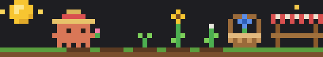
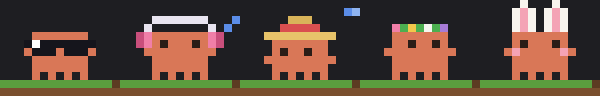
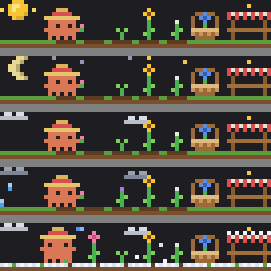

# 🌷 Garden Claude

A tiny pixel-art Claude who keeps a flower garden right above your Claude Code prompt.

Every time Claude replies or uses a tool while helping you, it does a little garden chore too. You write code; Claude grows flowers. 🌱



## 🧺 A day in the garden

| | |
| --- | --- |
| 🌰 **Plant** | Claude crouches and tosses a seed into an empty plot |
| 💧 **Water** | Tip the watering can and the flower grows, sometimes after a few drinks: seed → sprout → bud → bloom |
| 🌼 **Pick** | Claude picks a bloom and holds it up with a happy little hop |
| 🧺 **Basket** | Claude carries the flower over to the basket and drops it in with the others |
| 🪙 **Sell** | When the basket holds 3 flowers, Claude picks it up, carries it to the striped stall and sells them |

Claude looks after every flower, giving the thirstiest one nearby a drink first, so the garden blooms at its own easy pace. The caption under the garden says what's happening, like `watering tulip, bud` or `selling 3, +12 coins`.

Six kinds of flowers grow here, each worth a different number of coins:

daisy 2 · tulip 3 · lavender 3 · sunflower 4 · cornflower 4 · rose 5

Every session plants a fresh garden, but your coins are saved and shared by all your sessions, so every sale adds to the same pot. 💰 Next to the total, `↑12` shows what you've earned today; it starts over at midnight.

## 👒 The wardrobe

Claude puts on a new outfit every hour, and every outfit has its own idle animation.



- 😎 **Sunglasses**: a glint sweeps across the lenses
- 🎧 **Headphones**: bopping along while little music notes float up
- 👒 **Straw hat**: a blue butterfly circles the brim
- 🌸 **Flower crown**: the blossoms twinkle and swap colors
- 🐰 **Bunny ears**: blushing cheeks and an ear that flops now and then

When there's nothing to do, Claude strolls around the garden, stopping now and then to rest: breathing, blinking and glancing around.

## 🏡 Garden together

Run a few Claude Code sessions at once and their Claudes can share one garden. Up to three Claudes work side by side, each taking its own chore, so flowers grow and sell faster.

```
/garden-claude-room create
```

That opens a room and gives it a fruit for a code, like `MANGO`. There are 20 fruits, so up to 20 rooms can be open at once. In another session:

```
/garden-claude-room join MANGO
```

Now both sessions show the same garden with every Claude in it. The room's garden starts from the host's, the basket and coins are shared, and a Claude never tends a flower another one is already looking after.

- **Who's who.** In a room, a badge at the start of the caption says whether you're the `HOST` or `JOINED`, with the code and how many Claudes are in. It turns to `HOST AWAY` while the host's session is closed. Below it, a line for each Claude shows its accessory and what it's doing, and yours is marked `you`.
- **Pick your look.** In a room, `/garden-claude-accessory` lets you choose what your Claude wears, so everyone can tell the Claudes apart. Accessories someone else wears aren't offered.
- **Leaving.** `/garden-claude-room leave` takes you back to your own garden. If the host leaves, the room closes and everyone goes home. A room holds three Claudes, and a seat stays saved for a few minutes for someone whose session closed.
- **Restarting is fine.** Being idle never drops you. If the host closes their session, for example to update Claude Code, the room waits 5 minutes and `claude --resume` picks it back up. The others keep gardening in the meantime. `/clear` keeps your seat, and `/resume` takes you to whichever room the resumed conversation was in.
- **Host away for good?** `/garden-claude-room host MANGO` takes over a room whose host has stepped away.

Run `/garden-claude-room` on its own to see who's in your room. Rooms are for sessions on the same computer.

## 📊 Your stats, right next door

Next to the garden sits a little status board:

```
$8.70 · Opus 5.5
ctx ▆▆▆▁▁▁▁▁▁▁  32%
5h  ▁▁▁▁▁▁▁▁▁▁   1% · 4h25m
7d  ▆▆▆▁▁▁▁▁▁▁  34% · 2d23h
```

That's the session cost, the model, how full the context is, and your 5-hour and 7-day usage with time until each resets. The bars turn from green to gold at 70% and to red at 90%.

The board isn't pixel art like the garden: it's regular terminal text with chunky block bars, so the numbers stay easy to read.

Since this covers what most status lines show, you may want to turn off your own `statusLine` setting so the numbers don't show twice.

## 🌦️ Weather

Garden Claude's sky follows the real weather where you are.



- ☀️ **Clear**: a twinkling sun by day, and a crescent moon under twinkling stars at night
- ☁️ **Cloudy**: fluffy clouds drifting by
- 🌧️ **Rainy**: grey clouds and falling rain
- ❄️ **Snowy**: snowflakes drift down and the ground (and the stall's roof) gets a soft white blanket

Claude gardens with the weather too:

- 🌧️ **Rain** waters the flowers, so Claude skips the watering can and just plants, picks and sells.
- ❄️ **Snow** means a day off. Claude chills in the garden until it melts.

The weather is checked when Garden Claude starts and every 30 minutes after, and the city's name and weather show in the caption under the garden. If the weather service can't be reached, the sky is simply clear until it can.

**Where?** Garden Claude uses your computer's **time zone** to find your area, so there's nothing to set up. The caption shows your time zone's city in your language, like `台北 下雨` or `ワルシャワ 雪`. City names come from the Unicode CLDR project, the same names your computer uses. If your computer uses a time zone with no place attached, like `UTC`, the sky simply stays clear.

## 🌏 Languages

Garden Claude speaks five languages:

| | |
| --- | --- |
| `en` | English |
| `zh-TW` | 繁體中文 |
| `zh-CN` | 简体中文 |
| `ja` | 日本語 |
| `ko` | 한국어 |

By default it follows your **computer's language**. To switch:

```
/garden-claude-language
```

Pick from the list, or type it directly, like `/garden-claude-language zh-TW`. Use `auto` to follow your computer again.

## 🔒 Privacy

Garden Claude keeps things gentle:

- **No location tracking.** It never looks up your IP address or asks where you are. "Auto" only reads your computer's time zone, right on your machine.
- **One small request.** When it starts and every 30 minutes after, it asks [Open-Meteo](https://open-meteo.com), a free public weather service, for the weather at your time zone's location. Like any website, Open-Meteo sees that a request came in, but nothing else about you is sent.
- **Your language stays local.** It's read from your computer and never sent anywhere.
- **Saved on your machine.** Your coins, settings and rooms are stored by Claude Code on your computer only. Rooms connect sessions through that same local store, never over the network.

## 🌱 Install

```sh
claude plugin marketplace add milkoya/mods
claude plugin install garden-claude@milkoya
```

Start a new Claude Code session and your garden appears above the prompt.

**Or by hand:** clone this repo into `~/.claude/mods/garden-claude`, then either run `claude --plugin-dir ~/.claude/mods`, or add this to `~/.claude/settings.json` so it loads every time:

```json
{
  "env": {
    "CLAUDE_CODE_PLUGIN_DIRS": "~/.claude/mods"
  }
}
```

### Good to know

- Garden Claude is built on Claude Code's **function hooks**, an early-access feature that's still rolling out. If your Claude Code doesn't load it yet, it will once the feature reaches you.
- Garden Claude runs in the **Claude Code CLI** in your terminal.
- It fits itself to your window:
  - **87+ columns:** the garden with the stats board beside it; on wide windows the bars stretch out
  - **56–86 columns:** the garden with a one-line stats bar underneath
  - **Smaller:** just the stats and caption, as text
  - When space is tight, the caption drops the accessory and city first, so what Claude is doing always shows
- Collapse the band anytime with `ctrl+x ctrl+a`.

## 🛠️ Tinkering

| File | What's inside |
| --- | --- |
| `hooks/garden.ts` | The garden rules, the pixel painter, the weather and every animation |
| `hooks/i18n.ts` | Every word Garden Claude says, in five languages |
| `hooks/places.ts` | Finding the city for a time zone |
| `hooks/zones.ts` | Every time zone's location and city name in five languages, from the time zone database and Unicode CLDR |
| `hooks/weather.ts` | Turning Open-Meteo's forecast into sunny, cloudy, rainy or snowy |
| `hooks/room.ts` | Rooms: codes, seats, who's away, and who's busy with which flower |
| `hooks/layout.ts` | How the band fits different window sizes |
| `hooks/stats.ts` | The status board's bars and numbers |
| `hooks/register.tsx` | The hooks, commands and pickers that connect it all to Claude Code |

Check your changes with:

```sh
claude plugin validate .
claude plugin test .
```

## 💌 License

MIT © Mio. Plant freely, share freely. 🌼
